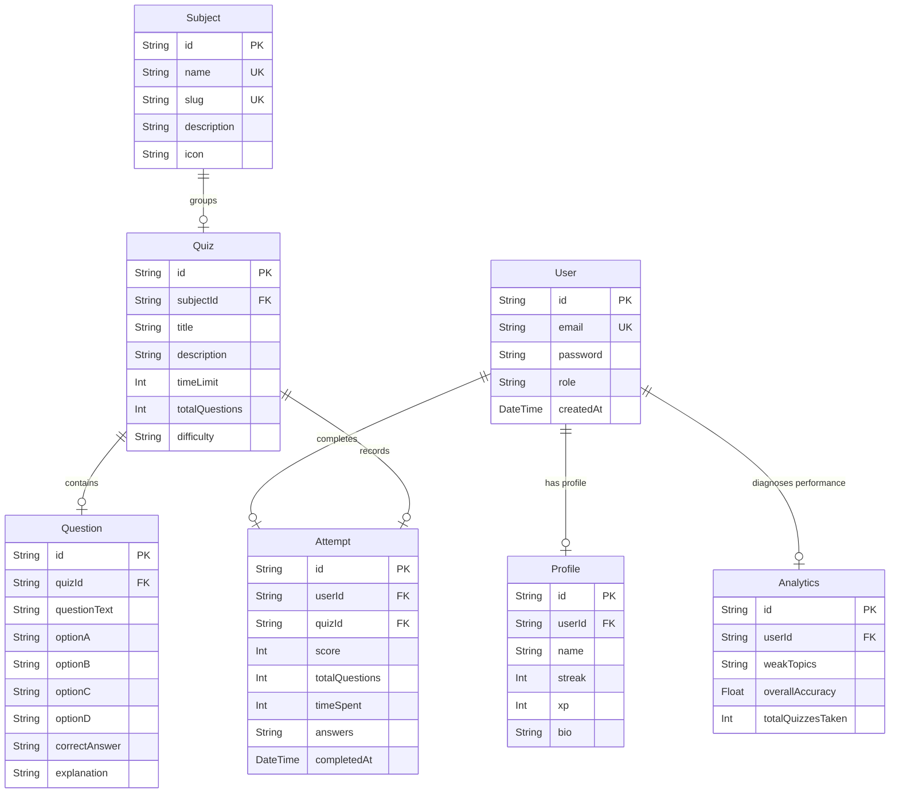

# AuraAcademy - End-to-End Scalable Student Learning Ecosystem

AuraAcademy is a production-grade, highly scalable student workspace designed to optimize study habits, trace microscopic syllabus weaknesses, and foster collaborative group learning. The platform blends an interactive timed quiz runner with custom-rendered SVG diagnostic analytics and a peer forum engine.

---

## 🌟 Core Features Built (Phase 1 MVP)

### 1. Interactive Timed Quiz Engine
* Timed exam papers modeled after real university midterm and final structures.
* Dynamic question navigator grid tracking answered, skipped, and flagged status in real-time.
* Auto-submission locks when the session countdown timer reaches zero.
* Instant post-exam scores, correctness classifications, and comprehensive background explanations.

### 2. Microscopic Analytics & Weak Topics Dashboard
* Micro-analytics mapping accuracy metrics directly to academic subjects (Mathematics, Quantum Physics, Computer Science).
* Automated diagnostics grouping low-performing subject sectors (below 70% accuracy) as "Weak Topics" with personalized study tips.
* Real-time experience points (XP) rewards and active study streak (🔥) calculation.
* Podium-style weekly scoreboard (Leaderboard) showing global rank, overall points, and streak status.

### 3. Stateless Cryptography Authentication & Route Interceptors
* Secure user signup and signin credentials validation.
* Secure pbkdf2 cryptographic hashing and verification (zero external C-native module compiling required).
* Lightweight, edge-ready JWT signing and cookie session injection.
* Edge-optimized Next.js routing Middleware protecting dashboard spaces from unauthenticated users.

---

## 📐 Enterprise System Architecture

AuraAcademy is engineered on Next.js 16 App Router using Turbopack for compilation. We employ a modular feature-based structure ensuring the project scales elegantly:

```text
src/
├── app/                  # Next.js App Router (Layouts, Pages, Headers)
├── components/           # Generic shared UI elements
├── features/             # Feature-specific states, indicators, and hooks
│   ├── auth/             # Login and signup views
│   ├── dashboard/        # Performance logs, quick-stats, search controls
│   ├── quizzes/          # Dynamic timed exam taker components
│   └── analytics/        # SVG charts and weakness diagnostics boards
├── lib/                  # Server-side initializations (Prisma client, JWT signers)
├── services/             # Direct database querying APIs & Server Actions
├── store/                # Zustand global states (active quiz runners, lightweight session)
├── types/                # Strict TypeScript declaration types
└── utils/                # Standard helper utilities ( Tailwind mergers )
```

---

## 💾 Core Database Schema (Prisma)



---

## 🚀 Quick Local Launch

1. **Clone & Install Dependencies**:
   ```bash
   cd frontend
   npm install
   ```

2. **Setup database configurations & generate local models**:
   ```bash
   npx prisma db push
   npx prisma generate
   ```

3. **Spin up local dev server**:
   ```bash
   npm run dev
   ```
   Navigate to [http://localhost:3000](http://localhost:3000) to begin!

---

## ⚡ Scalability & Security Notes

* **Security**: Password hashing utilizes Node's built-in pbkdf2 algorithm with uniquely salted iterations, preventing rainbow table attacks. JWT sessions use stateless HTTP-only cookies, preventing cross-site scripting (XSS) exposures.
* **Edge-Optimized Middleware**: Auth checks occur in Next.js Middleware under edge rules, immediately deflecting unauthorized visitors with minimal network overhead.
* **Database Scaling**: Designed with full relational integrity constraints (foreign keys, cascade deletes, unique indices). Moving from local SQLite to high-durability PostgreSQL takes a simple one-word provider switch in `schema.prisma`!
